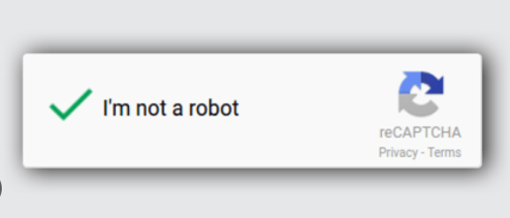

# CAPTCHA Recognition with CRNN (Convolutional Recurrent Neural Network)

This project focuses on CAPTCHA recognition using a Convolutional Recurrent Neural Network (CRNN) architecture. The model is trained to recognize text from CAPTCHA images, and the solution uses a ResNet18-based feature extractor followed by Recurrent Neural Networks (RNNs) for sequence prediction.

## Project Overview

CAPTCHA (Completely Automated Public Turing test to tell Computers and Humans Apart) is commonly used to verify that a user is human. The goal of this project is to build a model capable of recognizing and decoding text from CAPTCHA images automatically.

This project utilizes a combination of CNNs for feature extraction and RNNs to process sequences of characters in CAPTCHA images.

## Table of Contents

- [Prerequisites](#prerequisites)
- [Installation](#installation)
- [Dataset](#dataset)
- [Model Architecture](#model-architecture)
- [Training](#training)
- [Results](#results)
- [License](#license)

## Prerequisites

Ensure you have the following libraries installed:

- Python 3.x
- PyTorch
- torchvision
- OpenCV
- NumPy
- pandas
- matplotlib
- tqdm
- scikit-learn

The dataset used for training and testing the model is publicly available on Kaggle. You can download it from the following link:

- [Captcha Version 2 Images Dataset](https://www.kaggle.com/shawon10/captcha-recognition)

## Model Architecture

The model is based on a CRNN architecture, combining CNN and RNN layers:

- **ResNet18** as the backbone CNN for feature extraction.
- **GRU-based RNN** to process sequential data and decode the characters.
- **CTC Loss** for sequence-to-sequence learning.

### CRNN Model Structure:

- **CNN Layer 1**: ResNet18 for feature extraction.
- **CNN Layer 2**: Additional convolutional layer to refine the features.
- **RNN Layers**: Two GRU layers for sequence processing.
- **Fully Connected Layer**: Output layer for character classification.

### Character Mapping:

A custom character map is defined for recognizing characters in CAPTCHA images, which includes:

- Letters (a-z).
- A blank character for padding during CTC loss calculation.

## Training

The model is trained using the CTC Loss function and the Adam Optimizer.

### Hyperparameters:

- **Batch size**: 16
- **Learning rate**: 0.001
- **Epochs**: 50
- **Optimizer**: Adam
- **Dropout**: 0.1
